# 📋 Implementation Plan: WebSocket Multiplex Architecture

> **สถานะ:** 📝 Draft — เก็บไว้เผื่อปรับปรุงเมื่อจำนวน Asset เกิน 5 ตัว  
> **Created:** 2026-04-21  
> **Priority:** Low (ปัจจุบัน 3-5 asset ยังไม่จำเป็น)

---

## 1. สถาปัตยกรรมปัจจุบัน vs ใหม่

### ❌ ปัจจุบัน: 1 WebSocket ต่อ 1 Asset
```
Go Trade (vol10, vol25, vol75)
    │
    ├── WS Connection #1 → Deriv (vol10 bot)
    ├── WS Connection #2 → Deriv (vol25 bot)
    └── WS Connection #3 → Deriv (vol75 bot)
```
- 3 connections, authorize 3 ครั้ง
- State แยกเป็น local variable ใน function

### ✅ ใหม่: 1 WebSocket + Multiplex
```
Go Trade (vol10, vol25, vol75)
    │
    └── WS Connection #1 → Deriv
            ├── subscribe vol10 candles
            ├── subscribe vol25 candles
            └── subscribe vol75 candles
            
            State: HashMap<String, AssetState>
```
- 1 connection, authorize 1 ครั้ง
- State เก็บใน HashMap แยกด้วย asset key

---

## 2. โครงสร้างข้อมูลใหม่

### 2.1 สร้าง `AssetState` struct

```rust
// deriv.rs — State แยกต่อ Asset
pub struct AssetState {
    pub asset: String,              // "vol10", "vol25"
    pub deriv_symbol: String,       // "R_10", "R_25"  
    pub duration: i32,
    pub duration_unit: String,
    
    // Trading state
    pub current_history: Vec<OHLCV>,
    pub loss_con: u32,
    pub is_trading: bool,
    pub in_martingale: bool,
    pub last_trade_epoch: i64,
    pub trade_no: u32,
    pub sub_trade_no: u32,
    pub last_trade_details: Option<serde_json::Value>,
    
    // Contract tracking
    pub pending_contract_id: Option<String>,
}

impl AssetState {
    pub fn new(asset: String, granularity: i32) -> Self {
        let deriv_symbol = map_asset_to_symbol(&asset);
        let (duration, duration_unit) = get_duration_params(granularity);
        Self {
            asset,
            deriv_symbol,
            duration,
            duration_unit,
            current_history: Vec::new(),
            loss_con: 0,
            is_trading: false,
            in_martingale: false,
            last_trade_epoch: 0,
            trade_no: 1,
            sub_trade_no: 1,
            last_trade_details: None,
            pending_contract_id: None,
        }
    }
}
```

### 2.2 เปลี่ยน function signature

```rust
// เดิม: 1 bot ต่อ 1 asset  
pub async fn start_deriv_bot(
    app_id, api_token, config, asset, tx
)

// ใหม่: 1 bot ดูแลทุก asset
pub async fn start_deriv_bot_multiplexed(
    app_id: String,
    api_token: String,
    config: AppConfigPayload,
    assets: Vec<String>,    // ← รับหลาย asset
    tx: Arc<broadcast::Sender<serde_json::Value>>
)
```

---

## 3. ขั้นตอนการ Implement

### Phase 1: Refactor State Management

**ไฟล์:** `src/deriv.rs`

1. สร้าง `AssetState` struct ตามข้อ 2.1
2. แทนที่ตัวแปร local ทั้งหมด (loss_con, is_trading, etc.) ด้วย `HashMap<String, AssetState>`
3. Initialize state สำหรับทุก asset ที่เลือก:

```rust
let mut asset_states: HashMap<String, AssetState> = HashMap::new();
for asset in assets.iter() {
    asset_states.insert(
        asset.clone(), 
        AssetState::new(asset.clone(), config.granularity)
    );
}
```

### Phase 2: Subscribe หลาย Asset ใน WS เดียว

**หลัง Authorize สำเร็จ:**

```rust
if let Some(auth_data) = parsed.get("authorize") {
    // Subscribe candles สำหรับทุก asset
    for (_, state) in &asset_states {
        let ticks_request = json!({
            "ticks_history": state.deriv_symbol,
            "end": "latest",
            "style": "candles",
            "granularity": config.granularity,
            "count": candle_count,
            "subscribe": 1
        });
        ws_stream.send(Message::Text(ticks_request.to_string())).await?;
    }
}
```

### Phase 3: Route ข้อมูลขาเข้าแยกตาม Asset

**ปัญหาหลัก:** Deriv API ส่งข้อมูล OHLC กลับมาพร้อม `"echo_req"` ที่มี `"ticks_history"` 
หรือ field `"ohlc"."symbol"` → ใช้จุดนี้แยก asset

```rust
// เมื่อได้รับ candles history
if let Some(candles) = parsed.get("candles") {
    // ระบุ asset จาก echo_req
    let symbol = parsed.get("echo_req")
        .and_then(|e| e.get("ticks_history"))
        .and_then(|s| s.as_str())
        .unwrap_or("");
    
    // หา asset key จาก symbol
    let asset_key = find_asset_by_symbol(&asset_states, symbol);
    
    if let Some(state) = asset_states.get_mut(&asset_key) {
        // เพิ่ม candles เข้า state ของ asset นี้
        for c in arr {
            if let Some(ohlcv) = parse_candle(c) {
                state.current_history.push(ohlcv);
            }
        }
        // run analysis + broadcast...
    }
}

// เมื่อได้รับ OHLC realtime
if let Some(ohlc) = parsed.get("ohlc") {
    let symbol = ohlc.get("symbol")
        .and_then(|s| s.as_str())
        .unwrap_or("");
    
    let asset_key = find_asset_by_symbol(&asset_states, symbol);
    
    if let Some(state) = asset_states.get_mut(&asset_key) {
        // update candle + run analysis + check trade signal...
    }
}
```

### Phase 4: Route ผลเทรด (Buy/Proposal) แยกตาม Asset

**ปัญหา:** Deriv ส่ง `buy` response และ `proposal_open_contract` กลับมา 
→ ต้อง map contract_id กลับไปหา asset ที่สั่งซื้อ

```rust
// เมื่อสั่ง Buy → เก็บ req_id ที่ผูกกับ asset
// ใช้ req_id ที่แตกต่างกันต่อ asset เพื่อ track

// วิธี 1: ใช้ req_id เป็น hash ของ asset name
let req_id = hash_asset_to_id(&asset_key); // เช่น vol10=101, vol25=102

let buy_request = json!({
    "buy": 1,
    "parameters": { "symbol": state.deriv_symbol, ... },
    "req_id": req_id  // ← ใช้ track กลับ
});

// เมื่อได้ buy response → ดู req_id → หา asset
if let Some(buy_response) = parsed.get("buy") {
    let req_id = parsed.get("req_id").and_then(|r| r.as_i64()).unwrap_or(0);
    let asset_key = find_asset_by_req_id(req_id);
    
    if let Some(state) = asset_states.get_mut(&asset_key) {
        let contract_id = buy_response.get("contract_id")...;
        state.pending_contract_id = Some(contract_id.to_string());
    }
}

// เมื่อได้ proposal_open_contract → ดู contract_id → หา asset
if let Some(proposal) = parsed.get("proposal_open_contract") {
    let contract_id = proposal.get("contract_id")
        .and_then(|c| c.as_str()).unwrap_or("");
    
    // หา asset ที่มี pending_contract_id ตรงกัน
    let asset_key = asset_states.iter()
        .find(|(_, s)| s.pending_contract_id.as_deref() == Some(contract_id))
        .map(|(k, _)| k.clone());
    
    if let Some(key) = asset_key {
        if let Some(state) = asset_states.get_mut(&key) {
            // process win/loss, update martingale...
        }
    }
}
```

### Phase 5: อัปเดต main.rs

```rust
// เปลี่ยนจาก HashMap<String, JoinHandle> → Option<JoinHandle> (1 task)
pub struct AppState {
    pub tx: Arc<broadcast::Sender<serde_json::Value>>,
    pub active_bot: Arc<Mutex<Option<JoinHandle<()>>>>,
}

// handle_post_trade: spawn 1 task ส่ง assets ทั้งหมด
let handle = tokio::spawn(async move {
    if let Err(e) = deriv::start_deriv_bot_multiplexed(
        app_id, api_token, config, assets, tx
    ).await {
        eprintln!("Multiplexed bot crashed: {}", e);
    }
});
```

---

## 4. Helper Functions ที่ต้องสร้างเพิ่ม

```rust
/// หา asset key จาก Deriv symbol (e.g., "R_10" → "vol10")
fn find_asset_by_symbol(
    states: &HashMap<String, AssetState>, 
    symbol: &str
) -> String {
    states.iter()
        .find(|(_, s)| s.deriv_symbol == symbol)
        .map(|(k, _)| k.clone())
        .unwrap_or_default()
}

/// สร้าง unique req_id จากชื่อ asset
fn hash_asset_to_req_id(asset: &str) -> i64 {
    // ใช้ simple hash เพื่อ track buy request กลับ
    let mut hash: i64 = 1000;
    for b in asset.bytes() {
        hash = hash.wrapping_mul(31).wrapping_add(b as i64);
    }
    hash.abs() % 100000
}
```

---

## 5. ความเสี่ยง & ข้อควรระวัง

| ความเสี่ยง | ผลกระทบ | วิธีรับมือ |
|---|---|---|
| WS connection เดียว disconnect | **ทุก asset หยุดหมด** | ใส่ auto-reconnect loop + re-subscribe ทั้งหมด |
| Deriv rate-limit ใน WS เดียว | ส่งคำสั่งเร็วเกินไป → ถูก block | ใส่ delay 200ms ระหว่าง buy request |
| Contract ID ชนกัน 2 asset | ผลเทรดไปผิด asset | ใช้ pending_contract_id per-asset track |
| Message interleaving | OHLC ของ 2 asset มาสลับกัน | ใช้ `ohlc.symbol` field แยก route |
| Config reload กระทบทุก asset | เปลี่ยน ATR multi แต่บาง asset ไม่ต้องการ | พิจารณา per-asset config ในอนาคต |

---

## 6. ลำดับการทำงาน (Estimated: 4-6 ชั่วโมง)

```mermaid
gantt
    title Multiplex Implementation Timeline
    dateFormat HH:mm
    section Phase 1
    สร้าง AssetState struct           :p1, 00:00, 30min
    Refactor local vars → HashMap     :p2, after p1, 45min
    section Phase 2
    Subscribe หลาย asset             :p3, after p2, 30min
    section Phase 3 
    Route OHLC data by symbol         :p4, after p3, 60min
    Route candles_history by symbol   :p5, after p4, 30min
    section Phase 4
    Route buy/proposal by contract_id :p6, after p5, 60min
    section Phase 5
    Update main.rs (single task)      :p7, after p6, 20min
    Testing & Debug                   :p8, after p7, 60min
```



---

## 7. เมื่อไหร่ควรเปลี่ยน?

- ✅ **ยังไม่ต้องเปลี่ยน** ถ้าใช้ 1-5 assets
- ⚠️ **ควรพิจารณา** เมื่อ assets > 5 หรือ Deriv แจ้ง rate-limit
- 🔄 **ต้องเปลี่ยน** เมื่อ assets > 15 หรือต้องการ deploy หลาย account

---

> **Note:**  
> Plan นี้อ้างอิงจากโครงสร้างปัจจุบันของ `deriv.rs`, `main.rs`, `get_action.rs`  
> ก่อน implement ควรตรวจสอบ Deriv API documentation ล่าสุดอีกครั้ง  
> โดยเฉพาะ field ที่ใช้ระบุ asset ใน response message
