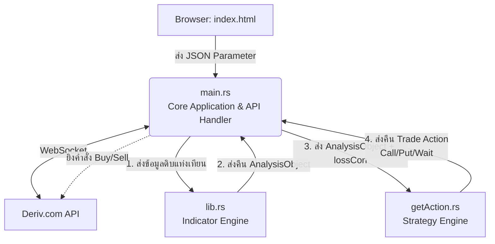

# แผนการดำเนินงานและสถาปัตยกรรมระบบ (System Architecture & Workflow Plan)

เอกสารนี้อธิบายสถาปัตยกรรมและแผนการดำเนินงานของระบบเทรดอัตโนมัติบน Rust ที่ทำงานร่วมกับ Deriv.com โดยอิงจากการแบ่งหน้าที่ของแต่ละไฟล์ในระบบอย่างชัดเจน

---

## โครงสร้างระบบภาพรวม (System Architecture)



---

## แผนการดำเนินงานแบ่งตาม Phase (Development Phases)

### Phase 1: สร้าง Data Structure และช่องทางเชื่อมต่อ (Gateway & Models)
1. **ออกแบบ Struct (Rust Models):** เขียน Rust structs เพื่อมารองรับ JSON payload แบบ Strongly-typed รวมถึงกำหนดชนิดข้อมูลย่อยให้ถูกต้องตามโครงสร้างที่ออกแบบไว้ (เช่น `TradeConfig`, `IndicatorConfig`, `EmaConfig`)
2. **สร้างช่องทางรับข้อมูล:** เซ็ตอัพ HTTP Server (เช่น Axum) หรือ WebSocket Server ที่ตัวไฟล์ `main.rs` เพื่อที่ระบบจะสามารถรับ Parameter จาก `index.html` เพื่อเข้าสู่ Core engine ได้

### Phase 2: ระบบดึงข้อมูลจาก Deriv API (`main.rs`)
1. **ระบบเชื่อมต่อ API:** เขียนโค้ดใน `main.rs` เพื่อเชื่อมต่อ WebSocket ของ Deriv (`wss://ws.binaryws.com/websockets/v3`)
2. **ระบบร้องขอข้อมูล (Requesting Data):** นำค่าจาก `JSON > dateRange` และ `granularity` ไปดึงข้อมูลแท่งเทียน (`ticks_history`) หรือ Subscribe รับค่าราคาแบบ Real-time
3. **จัดระเบียบข้อมูล:** แปลงค่าผลลัพธ์จาก API กลับมาจัดเก็บเป็นข้อมูลแท่งเทียนในรูปแบบ Vector ภายในตัวแปรเพื่อเตรียมส่งต่อสู่ระบบวิเคราะห์

### Phase 3: ระบบคำนวณ Indicators (`lib.rs` - Indicator Engine)
1. ตัว `main.rs` ส่งข้อมูลแท่งเทียนเข้าไปประมวลผลที่ `lib.rs`
2. **ประมวลผลอินดิเคเตอร์:** ระบบจะคำนวณค่าตาม Parameter ที่ปรับตั้งมาจาก JSON:
   - คำนวณ **ATR** เพื่อหาว่าแท่งเทียนใดเป็น Spike (`isAtr`)
   - คำนวณเส้น **EMA (Short, Medium, Long)** พร้อมหาทิศทางของเส้น เพื่อกำหนดค่า `emaShortDirection` (Up/Down) และ `emaMediumDirection` (Up/Down)
   - ระบุสีของแท่งเทียนปัจจุบัน (`thisColor`: green/red) 
3. **สร้าง AnalysisObject:** นำค่าที่คำนวณเสร็จแล้วทั้งหมดแพ็กรวมเป็น `AnalysisObject` แล้ว Return กลับสู่ `main.rs`

### Phase 4: ระบบตัดสินใจเทรด (`getAction.rs` - Strategy Engine)
ไฟล์นี้ทำงานเปรียบเสมือนสมองของฝั่งกลยุทธ์ โดยรับอิทธิพลจากไฟล์ `clsATRCandleAnalyzer.php` แต่เพิ่มเติม Indicator เข้ามา:
1. `main.rs` โยน `AnalysisObject` เข้ามาประมวลผล ร่วมกับแจ้งสถานการณ์ปัจจุบัน (`lossCon` - สถิติแพ้ติดกันกี่ครั้ง) ลงใน `getAction.rs`
2. **การหากลยุทธ์ (Decision Logic):** ประยุกต์ตรรกะการเลือกสีควบคู่กับการอ่าน EMA:
   - ตรวจสอบ `lossCon`: ถ้าแพ้น้อยกว่า 2 ไม้ อาจจะเทรดเล่นตามกลยุทธ์หลัก / หากแพ้มากกว่า 2 ไม้ขึ้นไป (`lossCon >= 2`) จะเริ่มเปลี่ยนเป้าเทรดสวนสี เพื่อแก้มือในสภาวะตลาดสวิง
   - ใช้ `emaShortDirection` กับ `emaMediumDirection` เข้ามาเป็นฟิลเตอร์ชั้นที่สองคอนเฟิร์มว่าทิศทางสอดคล้องกับ Action ที่จะออกไหม เพื่อลดความเสี่ยง
3. **คืนค่าผลลัพธ์ (Trade Action):** คืนค่ากลับไปบอกให้ตัวคอร์หลักเตรียมเทรด โดยแจ้งเป็นชนิดข้อมูล Action เช่น `TradeAction::Call`, `TradeAction::Put` หรือ `TradeAction::Wait`

### Phase 5: ระบบเทรดจริงและการเงิน (`main.rs` - Execution & Management) 
1. **กฎการบริหารหน้าตัก (Money Management):** นำค่าผลลัพธ์ Action ที่ต้องเทรด มาตรวจสอบคู่กับค่าย่อย `trade.martingale` เพื่อให้ได้ค่า Position Size (`targetLot`) ที่ถูกต้องตามประวัติ `lossCon` ครั้งล่าสุด
2. **ส่งคำสั่งเข้าพอร์ต (Trade Execution):** ถ้าระบบไม่ได้สั่ง `Wait` ตัว `main.rs` จะยิงคำสั่ง Buy contract ตรงเข้าไปยัง Deriv API ตามรายละเอียดสเป็คดังกล่าว
3. **ตรวจสอบเป้าหมาย (Stop Trade Condition):** อัปเดต Balance หลังจากทราบผลลัพธ์ออเดอร์ ตลอดเวลาที่ระบบกำลังวิ่ง จะแวะตรวจสอบว่าถึงเกณฑ์ `targetMoney` หรือไม่ หากแตะเป้าแล้วให้จบรอบสคริปต์ได้โดยสมบูรณ์

---

## ตัวอย่างแนวทางใน `getAction.rs` (Logic Template)
ระบบใน `getAction.rs` จะมีการออกแบบในลักษณะนี้ (Pseudo-code)

```rust
pub fn get_action(analysis: &AnalysisObject, loss_con: u32) -> TradeAction {
    let mut target_color = determine_base_color(&analysis.this_color, loss_con);
    
    // กรองด้วยเทรนด์อีกระดับเพื่อความปลอดภัย
    if target_color == "green" && analysis.ema_short_direction == "Down" {
        return TradeAction::Wait; 
    }
    
    match target_color.as_str() {
        "green" => TradeAction::Call,
        "red" => TradeAction::Put,
        _ => TradeAction::Wait,
    }
}
```
