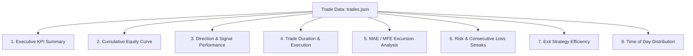

# 📊 รายงานการวิเคราะห์ผลการเทรดแบบพหุมิติ (Multi-Dimensional Trade Analysis Plan)

> **ข้อมูลอ้างอิงโครงสร้าง:** [`trades.json`](file:///d:/Rust/turbo-indicators/turbo-indicators_v2/indicators_Multiplex_Ver1/tradeData/08-2569/04-08-2569/1HZ50V/trades.json)  
> **เครื่องมือแสดงผลกราฟ:** **amCharts 5** (JavaScript Charting Library)  
> **ไฟล์ แดชบอร์ดตัวอย่างใช้งานจริง:** [`trade_report_dashboard.html`](file:///d:/Rust/turbo-indicators/turbo-indicators_v2/indicators_Multiplex_Ver1/public/trade_report_dashboard.html)

---

## 💡 1. ภาพรวมและฟิลด์ข้อมูลสำคัญใน `trades.json`

จากไฟล์ `trades.json` มีข้อมูลที่มีคุณค่าสูงและครอบคลุมหลายมิติ สามารถนำมาสกัดเป็นตัววัด (KPIs) และรายงานเชิงลึกได้ดังนี้:

| ฟิลด์ข้อมูล | ความหมาย / การนำไปใช้งานวิเคราะห์ |
| :--- | :--- |
| `contractId` / `tradeNo` | รหัสออเดอร์และลำดับการเทรด |
| `assetCode` | สัญลักษณ์สินทรัพย์ (เช่น `1HZ50V`) |
| `entrySpot` / `exitSpot` / `DiffSpot` | ราคาเข้า, ราคาออก, และส่วนต่างราคาแกว่งตัว |
| `purchaseTimeDisplay` / `sellTimeDisplay` | เวลาเริ่มเข้าเทรด และเวลาปิดออเดอร์ |
| `actualDuration` | ระยะเวลาที่ถือออเดอร์จริง (วินาที) |
| `thisAction` / `thisColor` | ทิศทางการเทรด (`CALL` / `PUT`) และสีแท่งเทียนขณะเข้า (`green` / `red`) |
| `WinStatus` / `ThisProfit` / `MoneyTrade` | ผลการเทรด (`Win`/`Loss`), กำไร/ขาดทุนสุทธิ ($), เงินลงทุน ($) |
| `lossCon` / `maxLossCon` | จำนวนการแพ้ติดกัน ณ ปัจจุบัน และแพ้ติดกันสูงสุด |
| `minProfit` / `maxProfit` | **MAE (Maximum Adverse Excursion)** ขาดทุนมากสุดระหว่างถือ และ **MFE (Maximum Favorable Excursion)** กำไรมากสุดระหว่างถือ |
| `targetProfit` / `exitStrategy` | เป้าหมายกำไรที่ตั้งไว้ และกลยุทธ์การปิดดีล (เช่น `targetProfit`, `expiryTime`) |
| `entrySignal` / `entryConditions` | สัญญาณตัวบ่งชี้ขณะเข้าซื้อ (เช่น `CrossUp`, `CrossDown`) |
| `emaPeriods` | ค่าพารามิเตอร์ EMA ที่ใช้ในการตัดสินใจ (เช่น `3-5-10`) |

---

## 📈 2. 8 รายงานที่ควรมีเพื่อวิเคราะห์ผลในหลากหลายแง่มุม

เพื่อให้เห็นประสิทธิภาพของบอท/กลยุทธ์เทรดอย่างรอบด้าน ควรจัดทำรายงานออกเป็น 8 มิติดังนี้:



### 🔹 รายงานที่ 1: สรุปภาพรวมและ KPI หลัก (Executive Summary & Core KPIs)
* **เป้าหมาย:** ประเมินภาพรวมความเสี่ยงและผลตอบแทนของระบบเทรดในพริบตา
* **ตัววัดสำคัญ (KPIs):**
  * **Win Rate (%):** `(จำนวนไม้ชนะ / จำนวนไม้ทั้งหมด) * 100`
  * **Net Profit ($):** ผลรวมกำไร/ขาดทุนทั้งหมด (`sum(ThisProfit)`)
  * **Profit Factor:** `Gross Profit / Gross Loss`
  * **Expectancy ($/Trade):** ค่าคาดหวังต่อการเทรด 1 ไม้
  * **Average Win / Average Loss Ratio (R:R Ratio):** อัตราส่วนกำไรเฉลี่ยต่อขาดทุนเฉลี่ย
* **ประเภทกราฟ amCharts:** **Gauge Chart** (แสดง % Win Rate เทียบเป้าหมาย) และ **Donut Chart** (แสดงสัดส่วน Win vs Loss)

---

### 🔹 รายงานที่ 2: เส้นโค้งผลตอบแทนสะสมและการเติบโต (Cumulative Equity Curve)
* **เป้าหมาย:** ดูแนวโน้มการเติบโตของกำไรตามลำดับเวลา และวิเคราะห์ช่วง Peak-to-Trough Drawdown
* **ข้อมูลที่ใช้:** `tradeNo`, `purchaseTimeDisplay`, `ThisProfit`
* **ประโยชน์:** บอกได้ว่าระบบกำไรสม่ำเสมอ หรือเสี่ยงจากการผันผวนสูง
* **ประเภทกราฟ amCharts:** **amCharts 5 XY Line Chart** พร้อม Gradient Color Fill (สีเขียวเมื่อสะสมเป็นบวก, สีแดงเมื่อสะสมเป็นลบ) และ Cursor Tooltip แสดงข้อมูลแต่ละจุด

---

### 🔹 รายงานที่ 3: ประสิทธิภาพตามทิศทางและสัญญาณ (Direction & Signal Analysis)
* **เป้าหมาย:** เปรียบเทียบความแม่นยำระหว่างคำสั่งซื้อขึ้น (`CALL`) กับ ขายลง (`PUT`) และสัญญาณ (`CrossUp` vs `CrossDown`)
* **ข้อมูลที่ใช้:** `thisAction`, `entrySignal`, `thisColor`, `WinStatus`, `ThisProfit`
* **ประโยชน์:** ปรับแต่งเงื่อนไขให้เทรดเฉพาะฝั่งที่มี Win Rate สูง หรือปิดสัญญาณฝั่งที่ขาดทุนบ่อย
* **ประเภทกราฟ amCharts:** **amCharts 5 Clustered Column Chart** (กราฟแท่งเปรียบเทียบกำไรสุทธิและอัตราชนะระหว่าง CALL vs PUT)

---

### 🔹 รายงานที่ 4: ระยะเวลาถือออเดอร์และการส่งคำสั่ง (Trade Duration & Speed Analysis)
* **เป้าหมาย:** วิเคราะห์ระยะเวลาถือออเดอร์ (`actualDuration`) ว่ามีผลต่อการ ชนะ/แพ้ อย่างไร
* **ข้อมูลที่ใช้:** `actualDuration`, `WinStatus`, `ThisProfit`, `exitStrategy`
* **ประโยชน์:** ช่วยประเมินว่าการถือออเดอร์สั้น (เช่น <30 วินาที) หรือถือนาน มีโอกาสชนะมากกว่ากัน
* **ประเภทกราฟ amCharts:** **amCharts 5 XY Column Chart / Scatter Chart** แยกสีตามไม้ Win (เขียว) และ Loss (แดง)

---

### 🔹 รายงานที่ 5: สภาวะแกว่งตัวระหว่างถือออเดอร์ (MAE / MFE & Excursion Analysis)
* **เป้าหมาย:** วัดความเสี่ยงจากการถูกลากขาดทุนก่อนชนะ (MAE) และวัดโอกาสทำกำไรสูงสุดที่เคยไปถึงก่อนปิดออเดอร์ (MFE)
* **ข้อมูลที่ใช้:** `minProfit` (MAE), `maxProfit` (MFE), `targetProfit`, `ThisProfit`
* **ประโยชน์:** 
  * ถ้า `maxProfit` สูงกว่า `targetProfit` มาก แปลว่าตั้งเป้ากำไรต่ำเกินไป
  * ถ้า `minProfit` ติดลบหนักมากก่อนกลับมาชนะ แปลว่า Stop Loss ปัจจุบันกว้างเกินไป เสี่ยงพอร์ตแตก
* **ประเภทกราฟ amCharts:** **amCharts 5 Range Bar Chart / Candlestick Style Chart** (แสดงช่วงแกว่งตัวจาก `minProfit` ถึง `maxProfit` ของแต่ละเทรด)

---

### 🔹 รายงานที่ 6: การบริหารความเสี่ยงและการแพ้ติดกัน (Consecutive Loss Streaks)
* **เป้าหมาย:** ตรวจสอบสถิติการแพ้ติดต่อกัน (`lossCon`, `maxLossCon`) เพื่อกำหนดกลยุทธ์ Money Management (เช่น Martingale / Fixed Fractional)
* **ข้อมูลที่ใช้:** `lossCon`, `maxLossCon`, `MoneyTrade`, `WinStatus`
* **ประโยชน์:** ป้องกันไม่ให้บอทเบิ้ลไม้จนเกินขีดจำกัดความเสี่ยงของบัญชี
* **ประเภทกราฟ amCharts:** **amCharts 5 Column Chart** (กระจายความถี่ของการแพ้ติดกัน 1 ไม้, 2 ไม้, 3 ไม้...)

---

### 🔹 รายงานที่ 7: ประสิทธิภาพของกลยุทธ์การปิดออเดอร์ (Exit Strategy Efficiency)
* **เป้าหมาย:** วิเคราะห์สาเหตุการปิดออเดอร์ (`targetProfit`, `expiryTime`, `gaveUp`) ว่าวิธีไหนสร้างกำไรได้ดีที่สุด
* **ข้อมูลที่ใช้:** `exitStrategy`, `gaveUp`, `ThisProfit`, `WinStatus`
* **ประเภทกราฟ amCharts:** **amCharts 5 Pie Chart / Donut Chart** แสดงสัดส่วนการปิดออเดอร์แยกตามสาเหตุ

---

### 🔹 รายงานที่ 8: ช่วงเวลาของวันที่ให้ผลตอบแทนดีที่สุด (Hourly & Session Distribution)
* **เป้าหมาย:** วิเคราะห์ว่าช่วงเวลาใดในรอบวัน (ชั่วโมง HH:00) มีความแม่นยำสูงที่สุด
* **ข้อมูลที่ใช้:** `purchaseTimeDisplay` (สกัดชั่วโมง), `WinStatus`, `ThisProfit`
* **ประเภทกราฟ amCharts:** **amCharts 5 Heatmap Chart / Column Chart** แยกสถิติตามชั่วโมง

---

## 🛠️ 3. ตัวอย่างการ 구현 และ โค้ด amCharts 5

สามารถใช้ไลบรารี **amCharts 5** เพื่อสร้างภาพตัวอย่างแดชบอร์ดปฏิสัมพันธ์ (Interactive Dashboard) ได้ดังนี้:

### 📍 โครงสร้างการเชื่อมต่อ amCharts 5 (CDN Links)
```html
<script src="https://cdn.amcharts.com/lib/5/index.js"></script>
<script src="https://cdn.amcharts.com/lib/5/xy.js"></script>
<script src="https://cdn.amcharts.com/lib/5/percent.js"></script>
<script src="https://cdn.amcharts.com/lib/5/themes/Animated.js"></script>
<script src="https://cdn.amcharts.com/lib/5/themes/Dark.js"></script>
```

---

### 💻 3.1 ตัวอย่างโค้ด amCharts 5 - Cumulative Equity Line Chart (เส้นโค้งผลตอบแทน)
```javascript
am5.ready(function() {
  var root = am5.Root.new("equityChartDiv");
  root.setThemes([am5themes_Animated.new(root), am5themes_Dark.new(root)]);

  var chart = root.container.children.push(am5xy.XYChart.new(root, {
    panX: true, panY: true, wheelX: "panX", wheelY: "zoomX",
    layout: root.verticalLayout
  }));

  // X Axis (Category/Trade Number)
  var xAxis = chart.xAxes.push(am5xy.CategoryAxis.new(root, {
    categoryField: "tradeNo",
    renderer: am5xy.AxisRendererX.new(root, { minGridDistance: 30 })
  }));

  // Y Axis (Cumulative Profit $)
  var yAxis = chart.yAxes.push(am5xy.ValueAxis.new(root, {
    renderer: am5xy.AxisRendererY.new(root, {})
  }));

  // Series
  var series = chart.series.push(am5xy.LineSeries.new(root, {
    name: "Cumulative Profit ($)",
    xAxis: xAxis,
    yAxis: yAxis,
    valueYField: "cumProfit",
    categoryXField: "tradeNo",
    tooltip: am5.Tooltip.new(root, {
      labelText: "Trade #{categoryX}\nกำไรสะสม: ${valueY}\nกำไรไม้นี้: ${thisProfit}"
    })
  }));

  series.strokes.template.setAll({ strokeWidth: 3, stroke: am5.color(0x10b981) });
  series.fills.template.setAll({
    fillOpacity: 0.2,
    visible: true,
    fill: am5.color(0x10b981)
  });

  // Load Trade Data & Compute Cumulative Profit
  var rawData = [ /* จาก trades.json */ ];
  var cum = 0;
  var chartData = rawData.map(function(item) {
    cum += item.ThisProfit;
    return {
      tradeNo: "Trade " + item.tradeNo,
      cumProfit: parseFloat(cum.toFixed(2)),
      thisProfit: item.ThisProfit
    };
  });

  xAxis.data.setAll(chartData);
  series.data.setAll(chartData);
  series.appear(1000);
  chart.appear(1000);
});
```

---

### 💻 3.2 ตัวอย่างโค้ด amCharts 5 - Win vs Loss Donut Chart (สัดส่วนการชนะ)
```javascript
am5.ready(function() {
  var root = am5.Root.new("winLossChartDiv");
  root.setThemes([am5themes_Animated.new(root), am5themes_Dark.new(root)]);

  var chart = root.container.children.push(am5percent.PieChart.new(root, {
    innerRadius: am5.percent(60),
    layout: root.verticalLayout
  }));

  var series = chart.series.push(am5percent.PieSeries.new(root, {
    valueField: "count",
    categoryField: "status"
  }));

  series.slices.template.setAll({ cornerRadius: 5 });
  series.slices.template.adapters.add("fill", function(fill, target) {
    if (target.dataItem.dataContext.status === "Win") return am5.color(0x10b981);
    return am5.color(0xef4444);
  });

  series.data.setAll([
    { status: "Win", count: 2 },
    { status: "Loss", count: 0 }
  ]);

  var legend = chart.children.push(am5.Legend.new(root, {
    centerX: am5.percent(50), x: am5.percent(50), marginTop: 15
  }));
  legend.data.setAll(series.dataItems);
  series.appear(1000);
});
```

---

### 💻 3.3 ตัวอย่างโค้ด amCharts 5 - MAE / MFE Range Bar Chart (วิเคราะห์การแกว่งตัวกำไร/ขาดทุน)
```javascript
am5.ready(function() {
  var root = am5.Root.new("maeMfeChartDiv");
  root.setThemes([am5themes_Animated.new(root), am5themes_Dark.new(root)]);

  var chart = root.container.children.push(am5xy.XYChart.new(root, {
    panX: true, panY: true, layout: root.verticalLayout
  }));

  var xAxis = chart.xAxes.push(am5xy.CategoryAxis.new(root, {
    categoryField: "tradeNo",
    renderer: am5xy.AxisRendererX.new(root, {})
  }));

  var yAxis = chart.yAxes.push(am5xy.ValueAxis.new(root, {
    renderer: am5xy.AxisRendererY.new(root, {})
  }));

  // Column Series for Low (minProfit) to High (maxProfit)
  var series = chart.series.push(am5xy.ColumnSeries.new(root, {
    name: "Profit Range (MAE to MFE)",
    xAxis: xAxis,
    yAxis: yAxis,
    valueYField: "maxProfit",
    openValueYField: "minProfit",
    categoryXField: "tradeNo",
    tooltip: am5.Tooltip.new(root, {
      labelText: "Trade #{categoryX}\nMAE (ติดลบสูงสุด): ${openValueY}\nMFE (กำไรสูงสุด): ${valueY}\nกำไรจริง: ${thisProfit}"
    })
  }));

  series.columns.template.setAll({
    width: am5.percent(40),
    cornerRadiusTL: 4, cornerRadiusTR: 4,
    fill: am5.color(0x3b82f6), stroke: am5.color(0x1d4ed8)
  });

  // Input Data mapped from trades.json
  var data = [
    { tradeNo: "#1 (CALL)", minProfit: -0.34, maxProfit: 0.11, thisProfit: 0.11 },
    { tradeNo: "#2 (PUT)",  minProfit: -0.08, maxProfit: 0.10, thisProfit: 0.10 }
  ];

  xAxis.data.setAll(data);
  series.data.setAll(data);
  series.appear(1000);
});
```

---

## 🖥️ 4. แดชบอร์ดสำเร็จรูปพร้อมใช้งาน (Live Web Dashboard)

เพื่อความสะดวกในการทดลองและวิเคราะห์ผลจริง ได้จัดทำไฟล์เว็บแดชบอร์ด **HTML5 + amCharts 5** ไว้ที่:

👉 **[`trade_report_dashboard.html`](file:///d:/Rust/turbo-indicators/turbo-indicators_v2/indicators_Multiplex_Ver1/public/trade_report_dashboard.html)**

### คุณสมบัติของ แดชบอร์ด:
1. **Interactive Charts:** สามารถเอาเมาส์ชี้ (Hover) เลื่อนดูรายละเอียดรายออเดอร์ ซูม และเลือกเปิด-ปิดอนุกรมข้อมูลได้
2. **Auto Load Data:** รองรับการดึงข้อมูลจาก `trades.json` โดยอัตโนมัติ หรือโหลดไฟล์ JSON เพิ่มเติม
3. **KPI Summary Cards:** คำนวณ Net Profit, Win Rate, Profit Factor, R:R Ratio และ MAE/MFE ให้อัตโนมัติ
4. **Dark Mode Dashboard:** สไตล์การออกแบบทันสมัย เหมาะกับการวิเคราะห์ข้อมูลเทรดเชิงลึก

---

## 📌 5. สรุปคำแนะนำสำหรับการปรับปรุงกลยุทธ์ (Actionable Takeaways)

1. **ตั้งค่า Target Profit เทียบกับ MFE (`maxProfit`):**
   * หาก `maxProfit` ไปถึง +0.20 - +0.30 บ่อยครั้ง แต่ `targetProfit` ตั้งไว้เพียง 0.10 อาจพิจารณาขยับ Target Profit ขึ้นเพื่อเพิ่มอัตรารายได้ต่อไม้
2. **ควบคุม Drawdown ระหว่างถือออเดอร์ (`minProfit` / MAE):**
   * หากบางไม้ออกมา Win แต่ระหว่างถือเคยลากติดลบถึง -0.34 (เทียบกับ stake $1.0 คิดเป็น -34%) ควรพิจารณาปรับ Trailing Stop หรือปรับปรุง Entry Spot ให้ได้จุดเข้าที่คมขึ้น
3. **ติดตามสถิติตามประเภท Exit (`exitStrategy`):**
   * หากคำสั่งส่วนใหญ่ปิดด้วย `targetProfit` ถือว่าเป็นสัญญาณดีที่ระบบทำงานตามแผน
