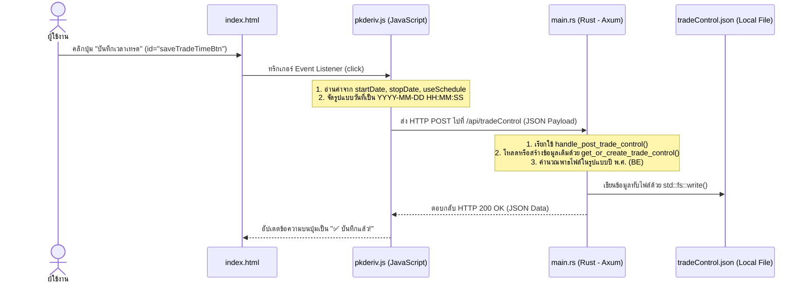

# บทเรียนที่ 1: สรุป Flow การทำงานของการคลิกปุ่ม "บันทึกเวลาเทรด"

เอกสารฉบับนี้อธิบายลำดับการทำงาน (Flow) เมื่อผู้ใช้งานคลิกปุ่ม **"บันทึกเวลาเทรด"** บนหน้าเว็บ (`index.html`) โดยจะเริ่มจากส่วนแสดงผลหน้าบ้าน (Frontend - JS) ส่งข้อมูลไปยังหลังบ้าน (Backend - Rust) และสิ้นสุดที่การบันทึกไฟล์ข้อมูล (.json)

---

## 📊 แผนผังลำดับการทำงาน (Flow Summary)



---

## 🔍 รายละเอียดของ Flow แต่ละส่วน

### 1. หน้าบ้าน (Frontend: HTML & JavaScript)
- **HTML Element**: ปุ่มมี `id="saveTradeTimeBtn"` อยู่ในไฟล์ [index.html](file:///d:/Rust/turbo-indicators/turbo-indicators_v2/indicators_Multiplex_Ver1/public/index.html).
- **JS Event Handler**: ถูกดักจับเหตุการณ์ในไฟล์ [pkderiv.js](file:///d:/Rust/turbo-indicators/turbo-indicators_v2/indicators_Multiplex_Ver1/public/pkderiv.js) ด้วยการคลิกปุ่มผ่าน `addEventListener('click')`.
- **Logic**:
  1. ดึงค่าเวลาเริ่มต้นจากไอดี `startDate` และเวลาสิ้นสุดจากไอดี `stopDate`.
  2. แปลงฟอร์แมตวันที่จากฟอร์แมตของ HTML (`YYYY-MM-DDTHH:MM`) ให้เป็นฟอร์แมตของฐานข้อมูลหลังบ้าน (`YYYY-MM-DD HH:MM:SS`).
  3. ดึงค่าสถานะช่องติ๊ก `useSchedule`.
  4. ทำการส่ง API Request โดยใช้ฟังก์ชัน `fetch` แบบ **POST** ไปยัง URL `/api/tradeControl` พร้อมกับส่ง JSON Body ในรูปแบบ:
     ```json
     {
         "startTradeTime": "YYYY-MM-DD HH:MM:SS",
         "stopTradeTime": "YYYY-MM-DD HH:MM:SS",
         "useSchedule": true/false
     }
     ```

---

### 2. หลังบ้าน (Backend: Rust - Axum Framework)
- **Router Mapping**: ใน [main.rs](file:///d:/Rust/turbo-indicators/turbo-indicators_v2/indicators_Multiplex_Ver1/src/main.rs) มีการแมปเส้นทางดังนี้:
  ```rust
  .route("/api/tradeControl", get(handle_get_trade_control).post(handle_post_trade_control))
  ```
- **Handler**: ฟังก์ชันที่รับหน้าที่ประมวลผลคือ `handle_post_trade_control(Json(payload))`
- **Logic**:
  1. เรียกฟังก์ชัน `get_or_create_trade_control()` เพื่อไปอ่านค่าปัจจุบันของ `TradeControl` จากไฟล์ JSON ขึ้นมาก่อน.
  2. อัปเดตฟิลด์ `start_trade_time`, `stop_trade_time` และ `use_schedule` ตามข้อมูลที่ Frontend ส่งมา.
  3. บันทึกผลลัพธ์กลับลงสู่ไฟล์ผ่านฟังก์ชัน `std::fs::write`.
- **การส่งข้อมูลกลับไปยัง JavaScript (Response Sending)**:
  * ในภาษา Rust (ผ่านเฟรมเวิร์ก Axum) จะใช้โครงสร้างข้อมูล **`axum::Json`** ในการส่งข้อมูลกลับ โดยมีโค้ดขากลับดังนี้:
    ```rust
    Json(serde_json::json!({
        "status": "success",
        "data": tc
    }))
    ```
  * **กลไกการทำงาน**:
    1. **`serde_json::json!`**: เป็นมาโครที่ช่วยแปลงข้อมูลใน Rust (ในที่นี้คือตัวแปร `tc` และคีย์ `"status"`) ให้กลายเป็นโครงสร้างข้อมูลแบบ JSON (`serde_json::Value`).
    2. **`axum::Json(...)`**: ทำหน้าที่เป็น Wrapper ห่อหุ้มข้อมูล JSON นั้น โดยมันจะอิมพลีเมนต์ trait `IntoResponse` ของ Axum ซึ่งทำงานโดยอัตโนมัติดังนี้:
       * แปลงข้อมูล Struct/Value ไปเป็น String รูปแบบ JSON (Serialization)
       * กำหนด HTTP Header `Content-Type: application/json` ให้อัตโนมัติ เพื่อบอกเบราว์เซอร์ว่าผลลัพธ์นี้เป็น JSON
       * ส่ง Response กลับไปยัง JavaScript ในฝั่งเบราว์เซอร์ด้วย HTTP Status Code `200 OK` (หากไม่มีข้อผิดพลาด)
    3. ฝั่ง JavaScript สามารถรับและใช้ค่าได้ทันทีผ่านตัวแปร Response เช่น ตรวจสอบความสำเร็จจาก `res.ok` หรือแกะข้อมูลโดย `await res.json()`

---

### 3. การบันทึกลงไฟล์ (File Storage)
- ข้อมูลจะถูกบันทึกลงในไฟล์ชื่อ **`tradeControl.json`**.
- พาธของไฟล์ถูกคำนวณแบบพลวัต (Dynamic Path) ผ่านฟังก์ชัน `get_trade_control_path()` โดยแยกโฟลเดอร์ตาม **เดือนและวันในรูปแบบปี พ.ศ. (ปี ค.ศ. + 543)**
- **โครงสร้างพาธ**:
  `tradeData/<เดือน-ปี พ.ศ.>/<วัน-เดือน-ปี พ.ศ.>/tradeControl.json`
- **ตัวอย่างเช่น** วันที่ 20 กรกฎาคม 2026 จะบันทึกลงที่:
  `tradeData/07-2569/20-07-2569/tradeControl.json`

---

## 📦 Cargo Libraries ที่เกี่ยวข้อง (Dependencies)

ในฝั่งหลังบ้าน (Backend) ที่เขียนด้วยภาษา Rust มีการใช้งาน Cargo Libraries (Crates) ต่าง ๆ ที่เกี่ยวข้องกับ Flow การบันทึกเวลาเทรดนี้ ดังต่อไปนี้:

1. **`axum`**
   * **หน้าที่ใน Flow นี้**: เป็น Web Framework ที่ใช้เปิด HTTP Server และจัดการ Routing โดยทำหน้าที่คอยรับ Request แบบ `POST` ที่ส่งมาจากหน้าบ้านมาที่ `/api/tradeControl` และแยกส่วนข้อมูลออกมาเป็น JSON ด้วย Extractor (`Json(payload)`) เพื่อส่งต่อไปยังฟังก์ชัน `handle_post_trade_control`

2. **`serde` & `serde_json`**
   * **หน้าที่ใน Flow นี้**: 
     * **`serde`**: เป็น Framework สำหรับแปลงข้อมูล (Serialization/Deserialization) ในที่นี้ช่วยให้เราสามารถใช้ `#[derive(Serialize, Deserialize)]` บน Rust Struct เพื่อบอกให้ Rust ทราบว่า Struct นี้สามารถแปลงไป-กลับเป็น JSON ได้
     * **`serde_json`**: เป็น Crate ที่แปลงรูปแบบข้อมูล JSON เป็น String หรือ Struct ใน Flow นี้ใช้ `serde_json::from_str` เพื่ออ่านค่าจากไฟล์ JSON มาเป็น Struct และใช้ `serde_json::to_string_pretty` เพื่อแปลง Struct ในโปรแกรมกลับไปเป็นรูปแบบ JSON เพื่อบันทึกเก็บไว้ในไฟล์

3. **`tokio`**
   * **หน้าที่ใน Flow นี้**: เป็น Asynchronous Runtime สำหรับภาษา Rust ซึ่ง Axum Framework ต้องรันอยู่บน Tokio ทำให้ฟังก์ชันหลังบ้านต่าง ๆ สามารถระบุคีย์เวิร์ด `async fn` เพื่อทำงานแบบ Asynchronous (ไม่บล็อกการทำงานหลัก) ได้

4. **`chrono`**
   * **หน้าที่ใน Flow นี้**: เป็นไลบรารีที่จัดการเกี่ยวกับเรื่อง วันที่ เวลา และ Timezone โดยใน Flow นี้จะใช้ `chrono::Local::now()` ดึงเวลาท้องถิ่น ณ ปัจจุบัน และใช้ดึงค่า วัน/เดือน/ปี พ.ศ. (ค.ศ. + 543) ผ่าน Trait `Datelike` เพื่อนำมาประกอบร่างเป็นชื่อโฟลเดอร์แบบพลวัต (เช่น `tradeData/07-2569/20-07-2569/...`)

5. **`std::fs` (Rust Standard Library)**
   * **หน้าที่ใน Flow นี้**: เป็นโมดูลมาตรฐานสำหรับจัดการระบบไฟล์ (File System Operations) โดยใน Flow นี้เรียกใช้:
     * `std::fs::create_dir_all`: เพื่อสร้าง Directory ย่อยตามวันที่ พ.ศ. ในกรณีที่รันระบบเป็นครั้งแรกของวันนั้น ๆ
     * `std::fs::read_to_string`: ใช้เปิดอ่านเนื้อหาในไฟล์ `tradeControl.json` ขึ้นมาประมวลผล
     * `std::fs::write`: ใช้เขียนทับข้อมูลลงไฟล์ `tradeControl.json` เมื่อผู้ใช้กดปุ่มบันทึกเวลาเทรดใหม่

---

## 💻 Source Code ทั้งหมดที่เกี่ยวข้อง

### 1. โค้ด HTML (`public/index.html`)
```html
<button type="button" class="fetch-btn" id="saveTradeTimeBtn" style="background:var(--green); color:#fff; border:none; padding:8px 12px; margin-right: 10px; border-radius:8px; cursor:pointer;">💾 บันทึกเวลาเทรด</button>
```

### 2. โค้ด JavaScript (`public/pkderiv.js`)
```javascript
const saveTradeTimeBtn = document.getElementById('saveTradeTimeBtn');
if (saveTradeTimeBtn) {
    saveTradeTimeBtn.addEventListener('click', async () => {
        const btn = saveTradeTimeBtn;
        const originalText = btn.textContent;
        btn.textContent = "⏳ กำลังบันทึก...";
        btn.disabled = true;

        let startRaw = document.getElementById('startDate').value;
        let stopRaw = document.getElementById('stopDate').value;
        let useSch = document.getElementById('useSchedule') ? document.getElementById('useSchedule').checked : false;

        let startFormat = startRaw ? startRaw.replace("T", " ") + ":00" : null;
        let stopFormat = stopRaw ? stopRaw.replace("T", " ") + ":00" : null;

        try {
            const res = await fetch('/api/tradeControl', {
                method: 'POST',
                headers: { 'Content-Type': 'application/json' },
                body: JSON.stringify({
                    startTradeTime: startFormat,
                    stopTradeTime: stopFormat,
                    useSchedule: useSch
                })
            });

            if (res.ok) {
                btn.textContent = "✅ บันทึกแล้ว!";
            } else {
                btn.textContent = "❌ บันทึกล้มเหลว";
            }
        } catch (e) {
            console.error("Could not save trade time:", e);
            btn.textContent = "❌ บันทึกล้มเหลว";
        }

        setTimeout(() => { btn.textContent = originalText; btn.disabled = false; }, 2000);
    });
}
```

### 3. โค้ด Rust (`src/main.rs`)

#### Data Structs
```rust
#[derive(Debug, Deserialize, Serialize, Clone)]
pub struct TradeControl {
    #[serde(rename = "DayTrade")]
    pub day_trade: String,
    #[serde(rename = "totalTrade")]
    pub total_trade: u32,
    #[serde(rename = "TradeStatus")]
    pub trade_status: String,
    #[serde(rename = "startTradeTime")]
    pub start_trade_time: String,
    #[serde(rename = "stopTradeTime")]
    pub stop_trade_time: String,
    #[serde(rename = "durationTrade")]
    pub duration_trade: String,
    #[serde(rename = "actionStop")]
    pub action_stop: String,
    #[serde(rename = "actualStartTime", default)]
    pub actual_start_time: String,
    #[serde(rename = "actualStopTime", default)]
    pub actual_stop_time: String,
    #[serde(rename = "useSchedule", default)]
    pub use_schedule: bool,
}

#[derive(Deserialize)]
pub struct UpdateTradeControlRequest {
    #[serde(rename = "startTradeTime")]
    pub start_trade_time: Option<String>,
    #[serde(rename = "stopTradeTime")]
    pub stop_trade_time: Option<String>,
    #[serde(rename = "useSchedule")]
    pub use_schedule: Option<bool>,
}
```

#### Route Mapping
```rust
.route("/api/tradeControl", get(handle_get_trade_control).post(handle_post_trade_control))
```

#### Handler Function
```rust
async fn handle_post_trade_control(Json(payload): Json<UpdateTradeControlRequest>) -> Json<serde_json::Value> {
    let mut tc = get_or_create_trade_control();
    if let Some(start) = payload.start_trade_time {
        tc.start_trade_time = start;
    }
    if let Some(stop) = payload.stop_trade_time {
        tc.stop_trade_time = stop;
    }
    if let Some(use_sch) = payload.use_schedule {
        tc.use_schedule = use_sch;
    }
    if let Ok(json_str) = serde_json::to_string_pretty(&tc) {
        let _ = std::fs::write(get_trade_control_path(), json_str);
    }
    Json(serde_json::json!({
        "status": "success",
        "data": tc
    }))
}
```

#### Helper Functions
```rust
fn get_trade_control_path() -> String {
    let now = chrono::Local::now();
    use chrono::Datelike;
    let month_folder = format!("{:02}-{:04}", now.month(), now.year() as i32 + 543);
    let day_folder = format!("{:02}-{:02}-{:04}", now.day(), now.month(), now.year() as i32 + 543);
    let today_dir = format!("tradeData/{}/{}", month_folder, day_folder);
    let _ = std::fs::create_dir_all(&today_dir);
    format!("{}/tradeControl.json", today_dir)
}

fn get_or_create_trade_control() -> TradeControl {
    let path = get_trade_control_path();
    let now = chrono::Local::now();
    use chrono::Datelike;
    let day_trade = format!("{:02}-{:02}-{:04}", now.day(), now.month(), now.year() as i32 + 543);
    
    if let Ok(content) = std::fs::read_to_string(&path) {
        if let Ok(tc) = serde_json::from_str::<TradeControl>(&content) {
            return tc;
        }
    }
    
    let date_prefix = format!("{:04}-{:02}-{:02}", now.year(), now.month(), now.day());
    let default_start = format!("{} 00:05:00", date_prefix);
    let default_stop = format!("{} 01:05:00", date_prefix);

    let tc = TradeControl {
        day_trade,
        total_trade: 0,
        trade_status: "ปิดเทรดอยู่".to_string(),
        start_trade_time: default_start,
        stop_trade_time: default_stop,
        duration_trade: "".to_string(),
        action_stop: "".to_string(),
        actual_start_time: "".to_string(),
        actual_stop_time: "".to_string(),
        use_schedule: false,
    };
    if let Ok(json_str) = serde_json::to_string_pretty(&tc) {
        let _ = std::fs::write(&path, json_str);
    }
    tc
}
```

🎯 สรุป:
Conventionใช้สำหรับตัวอย่างsnake_caseVariables, Functions, Methodsday_trade, calculate_pips()PascalCaseTypes, Structs, Enums, TraitsTradeData, OrderTypeUPPER_SNAKE_CASEConstants, StaticsMAX_TRADES, PIcamelCase❌ ไม่ใช้ใน Rust-

Rust ≠ ใช้ lowercase ทั้งหมด
Rust = ใช้ snake_case สำหรับ variables/functions
       + PascalCase สำหรับ types/structs
       + UPPER_SNAKE_CASE สำหรับ constants
คำตอบสั้น: Rust ไม่ใช้เพียง lowercase แต่ใช้ snake_case เป็นหลัก สำหรับ variables และ functions ครับ! 📖

🎯 ตาราเปรียบเทียบ:
สิ่งที่Conventionตัวอย่างใช้ได้ไหมVariablesnake_caseday_trade✅ ต้องใช้Functionsnake_casecalculate_pips()✅ ต้องใช้StructPascalCaseTradeData✅ ต้องใช้EnumPascalCaseOrderType✅ ต้องใช้TraitPascalCaseTradeable✅ ต้องใช้ConstUPPER_SNAKE_CASEMAX_TRADES✅ ต้องใช้camelCase-dayTrade❌ ไม่ใช้

---

## 🌐 ความเข้าใจผิด: ใน Flow นี้ใช้ HTTP หรือ WebSocket?

อาจจะเกิดความสับสนว่าระบบนี้มีการใช้งาน **WebSocket** หรือไม่? และทำไมขากลับจึงไม่ใช่การส่งข้อมูลผ่าน WebSocket?

คำตอบคือ **ใน Flow ของปุ่ม "บันทึกเวลาเทรด" นี้เป็นการสื่อสารผ่าน HTTP Request-Response แบบดั้งเดิม (ไม่ใช่ WebSocket) ครับ!**

นี่คือตารางเปรียบเทียบการทำงานของทั้งสองโปรโตคอลในโปรเจกต์นี้เพื่อให้เห็นภาพชัดเจน:

| คุณสมบัติ | HTTP (ใช้ใน Flow บันทึกเวลานี้) | WebSocket (ใช้ใน Flow อื่น ๆ ของระบบ) |
| :--- | :--- | :--- |
| **รูปแบบโปรโตคอล** | **Request-Response** (ร้องขอ -> ตอบกลับ) | **Full-Duplex / Event-Driven** (สองทางตลอดเวลา) |
| **จุดเริ่มต้น (Initiator)** | **หน้าบ้าน (JavaScript)** เป็นคนเริ่มส่งเสมอ | **หน้าบ้านเชื่อมต่อครั้งเดียว** จากนั้นส่งคุยกันได้ทั้งสองฝั่ง |
| **กลไกใน JavaScript** | ใช้ฟังก์ชัน `fetch('/api/tradeControl', { method: 'POST', ... })` | ใช้ `new WebSocket('ws://...')` หรือไลบรารีคล้ายคลึงกัน |
| **กลไกขากลับใน Rust** | ฟังก์ชัน `handle_post_trade_control` รีเทิร์น `Json(serde_json::json!({ ... }))` กลับไปทันทีที่ได้คำขอ | ใช้การ Broadcast ข้อความผ่าน channel (`state.tx.send`) ส่งหาไคลเอนต์ที่เชื่อมต่ออยู่ |
| **หน้าที่ในระบบนี้** | ใช้สำหรับงานประเภท **Command / Configuration** (สั่งงานครั้งเดียวเสร็จ เช่น บันทึกเวลาเทรด, กดหยุดบอท, โหลดการตั้งค่า) | ใช้สำหรับงานประเภท **Real-time Streaming** (ข้อมูลที่มีการเปลี่ยนแปลงตลอดเวลา เช่น ข้อมูลแท่งเทียน (Candles), Log การรันบอท (`bot_log`), การ sync ยอดเงินแบบเรียลไทม์) |

### 💡 ทำไม Flow บันทึกเวลานี้จึงเลือกใช้ HTTP POST แทน WebSocket?
1. **เป็นงานแบบ Transaction ครั้งเดียวจบ:** การเซฟเวลาเทรดเป็นแค่การอัปเดตการตั้งค่า เมื่อส่งข้อมูลไปหลังบ้านเซฟเสร็จ ก็ต้องการแค่สัญญาณตอบกลับสั้น ๆ ว่า "บันทึกสำเร็จ (200 OK)" หรือ "บันทึกล้มเหลว" การใช้ HTTP POST จึงมีความเรียบง่าย (Simple) และเสถียรมากกว่า
2. **ไม่ต้องประคองการเชื่อมต่อ (State-less):** HTTP ไม่จำเป็นต้องรักษาการเชื่อมต่อไว้ตลอดเวลาเหมือน WebSocket ทำให้ประหยัดทรัพยากรระบบในส่วนของการตั้งค่าที่ไม่ต้องอัปเดตแบบวินาทีต่อวินาที